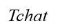

## A chat room for learing Boost.Asio.

Copyright (C) 2017 BSD 3-Clause Limited, Demiao Wu(@demiaowu@163.com). All rights reserved.

* [tchat GitHub](https://github.com/demiaowu/tchat)
* [tchat Documentation](doc)

## Build status

| [Linux][lin-link] | [Cygwin][cyg-link]  |
| :---------------: | :-----------------: |
| ![lin-badge]      |   ![lin-badge]      |

[lin-badge]: https://travis-ci.org/miloyip/rapidjson.png?branch=master 
[lin-link]:  https://github.com/demiaowu/tchat 
[win-badge]: https://ci.appveyor.com/api/projects/status/u658dcuwxo14a8m9/branch/master 
[cyg-link]:  https://github.com/demiaowu/tchat 

## Introduction

A chat room for learing Boost.Asio. Tchat is submitted for the homework. It only support chat room, but not support chat peer to peer. In addition, all of the message is burn after reading. Thank you for your interest and hope you will like it.

## Dependencies
Tchat uses following software as its dependencies:
* [CMake](https://cmake.org/) as a general build tool
* [Googletest 1.8.0](https://github.com/google/googletest) for unit and performance testing
* [Boost](http://www.boost.org/)
* [Boost.asio](http://think-async.com/) for network communication
* [Rapidjson 1.1.0](https://github.com/miloyip/rapidjson) for json data parsing

## Compatibility

Since the dependencies of tchat are all cross-platfrom, tchat is cross-platform in theory. Some platform/compiler combinations which have been tested are shown as follows.
* GNU C++ 4.8.x on Linux
* GNU C++ 4.8.x on Cygwin

Users can build and run the unit tests on their platform/compiler.

## Installation

1. install the dependencies as above
2. modify the CMakeLists.txt to add the `include` and `libs` accordingly
3. `cd ${tchat home}`
4. `cmake .`
5. `make`
6. `cd ${tchat home}/bin`. you can get `server`, `client` ,`tests`.

## Usage at a glance

This simple example as follows.
#### server  

`./server [ip] [port]` launching server, then the client can be used.
#### client  
`./client [server-ip] [server-port]` enter `free` mode. In this mode, you can use  `chat -l` to show all rooms created in the server, then, `chat -j [room-id]` to join
the room which you interesting. Of course, `chat -c [room-name]` can be used for creating a room by yourself. After enter a chat room, the mode is `chat`mode, then you can use `chat -s [message-content]`
to send message. It can be received by all of the room members. `chat -e` exit current room.

#### tests
`./tests` run all unit test examples.

## Notes

Current version only implement the basic commutation, much more **bugs** and works will be done in future.  The _TODO_ lists as follows:

* many command have not been implemented
* timeout management
* log file scrolling
* support cpp11/14
* optimize interactive processes
* more doc
* more unit tests 
